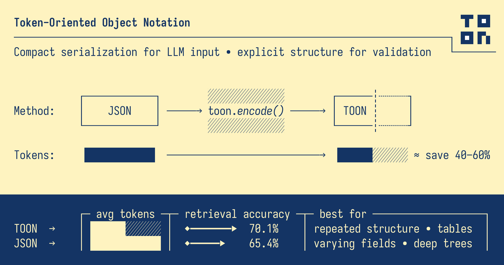

# Toon.DotNet
---


[](https://dotnet.microsoft.com/download)
[](https://docs.microsoft.com/en-us/dotnet/standard/net-standard)
[](https://github.com/CharlesHunt/ToonDotNet/actions/workflows/dotnet.yml)
[](https://dotnet.microsoft.com/download)

[](https://www.nuget.org/packages/Toon.DotNet)
[](https://www.nuget.org/packages/Toon.DotNet)

[](LICENSE)

---
Token-Oriented Object Notation (TOON) Serializer — a compact, human-readable serialization format designed for passing structured data to Large Language Models with significantly reduced token usage. TOON shines for uniform arrays of objects and readable nested structures. Optimised for .Net 10.0 plus backwards compatible with earlier versions. 

- Token-efficient alternative to JSON for LLM prompts
- Human-friendly and diff-friendly
- Strongly-typed decode support via System.Text.Json
- Strict validation options and round-trip helpers
- Direct JSON-to-TOON and TOON-to-JSON conversion methods for seamless interoperability.
- Synchronous and **async** file operations for reading and writing TOON and JSON data.
- **Stream support** — encode to and decode from any `Stream`, sync and async, all targets.
- 446 Unit tests with > 89% coverage. 100% passing.
- Examples included. 

---
**Targets:** 
.NET Standard 2.0 - maximum compatibility.
.NET 10 - dependency free.

---
## License
[](LICENSE)

---
## How it works

---
## Installation

Install from NuGet:

```
dotnet add package Toon.DotNet
```
---
## Compatibility
- .Net10.0 - dependency free
- .Net9.0
- .Net8.0
- .Net Standard 2.0 (.NET Framework 4.6.1+, Mono and Unity)

---
## Quick start

```csharp
using ToonFormat;

var data = new {
 users = new[] {
 new { id =1, name = "Alice", role = "admin" },
 new { id =2, name = "Bob", role = "user" }
 }
};

// Encode to TOON
string toon = Toon.Encode(data);
// users[2]{id,name,role}:
//1,Alice,admin
//2,Bob,user

// Decode to JsonElement
var json = Toon.Decode(toon);

// Decode to a typed model
var users = Toon.Decode<UserData>(toon);

public class UserData { public User[] Users { get; set; } = Array.Empty<User>(); }
public class User { public int Id { get; set; } public string Name { get; set; } = ""; public string Role { get; set; } = ""; }
```
---
## API overview

#### Basic Serilialization methods
- `Toon.Encode(object value, EncodeOptions? options = null)`
- `Toon.Decode(string input, DecodeOptions? options = null)` → `JsonElement`
- `Toon.Encode(DataTable table, EncodeOptions? options = null)`
- `Toon.Decode<T>(string input, DecodeOptions? options = null, JsonSerializerOptions? jsonOptions = null)`
#### Stream operations
- `Toon.Encode(object? value, Stream stream, EncodeOptions? options = null, Encoding? encoding = null)`
- `Toon.Decode(Stream stream, DecodeOptions? options = null, Encoding? encoding = null)` → `JsonElement`
- `Toon.Decode<T>(Stream stream, DecodeOptions? options = null, JsonSerializerOptions? jsonOptions = null, Encoding? encoding = null)` → `T`
- `Toon.EncodeAsync(object? value, Stream stream, EncodeOptions? options = null, Encoding? encoding = null, CancellationToken ct = default)` → `Task`
- `Toon.DecodeAsync(Stream stream, DecodeOptions? options = null, Encoding? encoding = null, CancellationToken ct = default)` → `Task<JsonElement>`
- `Toon.DecodeAsync<T>(Stream stream, DecodeOptions? options = null, JsonSerializerOptions? jsonOptions = null, Encoding? encoding = null, CancellationToken ct = default)` → `Task<T>`
- `Toon.Encode(DataTable table, Stream stream, EncodeOptions? options = null, Encoding? encoding = null)` *(.NET 8+ / not available on .NET Standard 2.0)*
#### TextWriter / TextReader operations
- `Toon.Encode(object? value, TextWriter writer, EncodeOptions? options = null)`
- `Toon.Decode(TextReader reader, DecodeOptions? options = null)` → `JsonElement`
- `Toon.Decode<T>(TextReader reader, DecodeOptions? options = null, JsonSerializerOptions? jsonOptions = null)` → `T`
#### Json Conversion methods
- `Toon.FromJson(string jsonString, EncodeOptions? options = null)` - **Efficient JSON-to-TOON conversion**
- `Toon.FromJsonFile(string jsonFilePath, EncodeOptions? options = null)` - **Convert JSON files to TOON**
- `Toon.ToJson(string toonString, DecodeOptions? decodeOptions = null, JsonSerializerOptions? jsonOptions = null)` - **Efficient TOON-to-JSON conversion**
- `Toon.ToJsonFile(string toonFilePath, DecodeOptions? decodeOptions = null, JsonSerializerOptions? jsonOptions = null)` - **Convert TOON files to JSON**
- `Toon.SaveAsJson(string toonString, string jsonFilePath, DecodeOptions? decodeOptions = null, JsonSerializerOptions? jsonOptions = null)` - **Save TOON as JSON file**
#### Validation and Utilities
- `Toon.IsValid(string input, DecodeOptions? options = null)`
- `Toon.RoundTrip(object value, EncodeOptions? encodeOptions = null, DecodeOptions? decodeOptions = null)`
- `Toon.SizeComparisonPercentage<T>(T input, EncodeOptions? encodeOptions = null)`
#### File operations
- `Toon.Save(object? value, string filePath, EncodeOptions? options = null)`
- `Toon.Load<T>(string filePath, DecodeOptions? options = null, JsonSerializerOptions? jsonOptions = null)`
- `Toon.Load(string filePath, DecodeOptions? options = null)`
#### Async file operations
- `Toon.SaveAsync(object? value, string filePath, EncodeOptions? options = null, CancellationToken ct = default)`
- `Toon.SaveAsync(DataTable table, string filePath, EncodeOptions? options = null, CancellationToken ct = default)` *(.NET 8+ / not available on .NET Standard 2.0)*
- `Toon.LoadAsync(string filePath, DecodeOptions? options = null, CancellationToken ct = default)` → `Task<JsonElement>`
- `Toon.LoadAsync<T>(string filePath, DecodeOptions? options = null, JsonSerializerOptions? jsonOptions = null, CancellationToken ct = default)` → `Task<T>`
- `Toon.FromJsonFileAsync(string jsonFilePath, EncodeOptions? options = null, CancellationToken ct = default)` → `Task<string>`
- `Toon.ToJsonFileAsync(string toonFilePath, DecodeOptions? options = null, JsonSerializerOptions? jsonOptions = null, CancellationToken ct = default)` → `Task<string>`
- `Toon.SaveAsJsonAsync(string toonString, string jsonFilePath, DecodeOptions? options = null, JsonSerializerOptions? jsonOptions = null, CancellationToken ct = default)`

---
### Stream operations

All encode and decode methods have `Stream` overloads, suitable for HTTP response bodies, `MemoryStream` pipelines, and any other stream-based scenario. Streams are always **left open** — disposal is the caller's responsibility.

```csharp
// Encode to any writable stream
using var ms = new MemoryStream();
Toon.Encode(data, ms);

// Decode from any readable stream
ms.Position = 0;
JsonElement result = Toon.Decode(ms);

// Strongly-typed decode from stream
ms.Position = 0;
var typed = Toon.Decode<UserData>(ms);

// Async variants (all targets, full CancellationToken support on .NET 8+)
using var responseStream = await httpClient.GetStreamAsync(url);
var result = await Toon.DecodeAsync(responseStream);

using var outStream = File.OpenWrite("output.toon");
await Toon.EncodeAsync(data, outStream);

// Custom encoding (default is UTF-8)
Toon.Encode(data, stream, encoding: Encoding.Unicode);
```

**Notes:**
- Default encoding is **UTF-8** for all stream methods.
- The stream's current position is read from / written to as-is; seek if necessary before calling.
- Compile-time behaviour: on .NET 8+, `EncodeAsync` uses `await using` with `DisposeAsync` for a fully async flush. On .NET Standard 2.0, a sync `Flush` is issued before dispose (the buffer write is tiny and non-blocking in practice).

---
### TextWriter / TextReader operations

`TextWriter` and `TextReader` overloads let you encode and decode directly to and from any text-based abstraction — `StringWriter`, `StreamWriter`, ASP.NET Core's `HttpResponse.Body` writer, and so on. All targets are supported, including .NET Standard 2.0.

```csharp
// Encode to any TextWriter (e.g. StringWriter, StreamWriter)
using var sw = new StringWriter();
Toon.Encode(data, sw);
string toon = sw.ToString();

// Decode from any TextReader (e.g. StringReader, StreamReader)
using var sr = new StringReader(toon);
JsonElement result = Toon.Decode(sr);

// Strongly-typed decode from a TextReader
using var sr2 = new StringReader(toon);
var typed = Toon.Decode<UserData>(sr2);

// DataTable encode direct to a Stream (.NET 8+ only)
using var ms = new MemoryStream();
Toon.Encode(dataTable, ms);
```

**Notes:**
- `Encode(object?, TextWriter, ...)` calls `Flush()` on the writer before returning; the writer itself is left open.
- `Decode(TextReader, ...)` reads the entire reader content via `ReadToEnd()` then delegates to the standard string decode path.
- `Encode(DataTable, Stream, ...)` is only available on .NET 8, .NET 9, and .NET 10 (not .NET Standard 2.0).

---
### Async file operations

Every file operation has a `*Async` counterpart that is safe to use in ASP.NET Core, Blazor, and any other async context. All methods accept an optional `CancellationToken`.

```csharp
// Save and load TOON files asynchronously
await Toon.SaveAsync(data, "output.toon");
JsonElement result = await Toon.LoadAsync("output.toon");
var typed = await Toon.LoadAsync<UserData>("output.toon");

// Save a DataTable to a TOON file asynchronously (.NET 8+)
var table = new DataTable();
table.Columns.Add("id", typeof(int));
table.Columns.Add("name", typeof(string));
table.Rows.Add(1, "Alice");
table.Rows.Add(2, "Bob");
await Toon.SaveAsync(table, "output.toon");

// Convert JSON files to TOON and back, asynchronously
string toon = await Toon.FromJsonFileAsync("data.json");
string json = await Toon.ToJsonFileAsync("data.toon");
await Toon.SaveAsJsonAsync(toon, "output.json");

// With cancellation
using var cts = new CancellationTokenSource(TimeSpan.FromSeconds(30));
await Toon.SaveAsync(data, "output.toon", cancellationToken: cts.Token);
```

**Compatibility note:** All async methods compile for .NET Standard 2.0 through .NET 10. On .NET 8+ the `CancellationToken` is forwarded to `File.ReadAllTextAsync` / `File.WriteAllTextAsync`. On .NET Standard 2.0, cancellation is accepted but not observed (the underlying `StreamReader`/`StreamWriter` APIs predate cancellable overloads).

---
### JSON to TOON Conversion

The most efficient way to convert JSON to TOON format:

**Why use `FromJson`?**
- **More efficient**: Parses JSON directly to TOON without intermediate object creation
- **Memory efficient**: Single parse operation with minimal allocations
- **Faster**: Bypasses object serialization/deserialization overhead
- **Flexible**: Works with any valid JSON string or file

---
### TOON to JSON Conversion

The most efficient way to convert TOON format back to JSON:

**Why use `ToJson`?**
- **Efficient**: Direct TOON decoding to JSON string
- **Flexible output**: Control JSON formatting (compact or indented)
- **Interoperability**: Easy integration with systems that require JSON
- **Bidirectional**: Perfect complement to `FromJson` for round-trip conversions

---
### Options

`EncodeOptions`
- `Indent` — spaces per level (default:2)
- `Delimiter` — value delimiter for rows/inline arrays (default: ',')
- `LengthMarker` — optional array length marker (e.g. '#')

`DecodeOptions`
- `Indent` — expected spaces per level (default:2)
- `Strict` — validate lengths/row counts and forbid stray blank lines

---
### Customization example

```csharp
var opts = new EncodeOptions {
 Indent =4,
 Delimiter = '|',
 LengthMarker = '#'
};
var toon = Toon.Encode(data, opts);
```

---
### Size comparison example

```csharp
// original data
var data = new[] {
 new { id =1, name = "Alice", role = "admin" },
 new { id =2, name = "Bob", role = "user" },
 new { id =3, name = "Charlie", role = "user" },
 new { id =4, name = "Dana", role = "admin" },
};

// encode with custom options
var encodeOptions = new EncodeOptions {  Indent = 2, Delimiter = '|' };
var toon = Toon.Encode(data, encodeOptions);
// => id|name|role
//   -+----+------+
//    1|Alice|admin |
//    2| Bob | user |
//    3|Charlie| user |
//    4| Dana |admin |

// get size comparison percentage
var pct = Toon.SizeComparisonPercentage(data, encodeOptions);
// ⇒ 28.57 (TOON is ~28.57% smaller than JSON for this data)

```
---
## When to use TOON

- Uniform arrays of objects (tabular data)
- Human-readable prompt payloads for LLMs
- Compact, copy/paste friendly format with stable structure

For deeply nested, highly irregular data, plain JSON may be more compact.

---
## Package Dependencies

Depending on the target framework, the following dependencies are used:

- System.Text.Json (part of .NET)
- Microsoft.SourceLink.GitHub (for source linking in PDBs)
- NetStandard.Library (for .NET Standard 2.0 compatibility)

---
## Samples

See `examples/ToonFormat.Example` for a runnable console sample.

---
## Versioning

This project follows semantic versioning. See [`CHANGELOG.md`](./CHANGELOG.md) for release notes.

---
## Contributing

Contributions are welcome. See [`CONTRIBUTING.md`](./CONTRIBUTING.md) and [`CODE_OF_CONDUCT.md`](./CODE_OF_CONDUCT.md).

---
## Security

Please see [`SECURITY.md`](./SECURITY.md) for reporting vulnerabilities.

---
## License

MIT License — see [`LICENSE`](./LICENSE).
